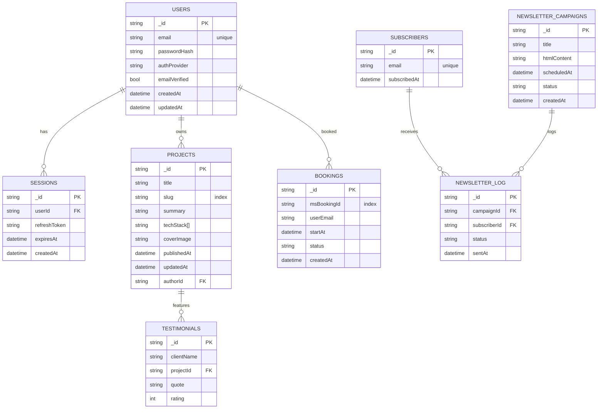

# CoderStew Website — Product Requirements Document (PRD)

_Last updated: 2025-07-13_  

---

## 1 · Mission & Scope
- **Company:** **CoderStew** – freelance web‑app development studio.  
- **Primary conversion goal:** Visitors book a **30‑minute discovery call** via Microsoft Bookings.  
- **Secondary goals:**  
  1. Add **1 000 newsletter subscribers** within 6 months.  
  2. Rank **top‑5** on Google for “freelance web app developer Utah.”  
- **Phase‑1 exclusions:** No e‑commerce, no gated member area (planned for Phase 2).

## 2 · Essential Background
- **Audience:** Owners & CTOs of small‑ to mid‑sized businesses that need custom web apps.  
- **Current pain points:**  
  1. Unclear pricing.  
  2. Scattered case studies.  
  3. Slow mobile speed.

## 3 · User Personas & Jobs‑to‑Be‑Done

| Name | Role | Goal | Pain‑point | JTBD statement |
|------|------|------|------------|----------------|
| **Megan** | Startup CTO | Ship MVP in < 3 mo | In‑house devs are booked solid | *When my investors approve the MVP budget, I want a freelance team that can start next week so I can hit our beta launch.* |
| **Carlos** | Owner, small manufacturer | Replace fragile Excel workflow | No idea what custom software costs | *When staff keep breaking the sales spreadsheet, I want an upfront quote so I can budget without surprises.* |
| **Lena** | Product Manager @ SaaS | Add white‑label portal | Mobile load times tank | *When users complain about slow mobile pages, I want a proven dev partner who can fix performance so churn drops.* |

---

## 4 · Goals & Success Metrics

| Metric | Baseline (Jul 2025) | Target (Jan 2026) |
|--------|-----------------------|----------------------|
| **Monthly unique visitors** | 1 200 | **6 000** |
| **Discovery‑call bookings** | 8 / mo | **40 / mo** |
| **Newsletter sign‑ups** | 0 | **1 000 total** |
| **Largest Contentful Paint (3 G)** | 3.1 s | **≤ 2 s** |
| **Time to Interactive (3 G)** | 4.0 s | **≤ 3 s** |
| **Google Lighthouse SEO** | 78 | **≥ 90** |

---

## 5 · Functional Requirements

| Feature | Priority | Acceptance Criterion (Definition of Done) |
|---------|----------|-------------------------------------------|
| **Backpack for Laravel CMS** | **Must** | Admin creates/edits pages, testimonials, portfolio items & newsletters via Backpack; role‑based permissions enforced; changes appear on front‑end within 5 min. |
| Portfolio gallery w/ filters | **Must** | Selecting _Tech = Vue_ instantly (< 300 ms) returns correct subset. |
| Pricing page | **Must** | Three tier cards; clicking **Start** opens Bookings modal. |
| Microsoft Bookings embed | **Must** | Booking confirmation sent from existing 365 tenant; event added to company calendar. |
| Contact form + validation + Google reCAPTCHA | **Must** | Invalid email shows inline error; spam score ≤ 0.3 passes. |
| **Newsletter (self‑hosted list)** | **Must** | Visitor submits email → stored in `subscribers` collection; double‑opt‑in email sent within 60 s. |
| Testimonial / case‑study module | **Should** | At least one testimonial auto‑surfaces on every service page; 50 req/s load test < 200 ms avg. |
| Blog (markdown + tags, RSS) | **Should** | Publishing post adds it to RSS and updates `sitemap.xml`. |
| Admin dashboard (Plausible + GlitchTip) | **Should** | Shows last‑7‑day visitors & error count; dashboard loads < 5 s. |
| Search (Algolia DocSearch) | **Could** | Typing “Laravel” returns results < 200 ms. |
| Dark‑/light‑mode toggle | **Could** | State stored in `localStorage`; respected on next visit. |

---

## 6 · Non‑Functional Requirements
- **Performance:** LCP < 2 s (3 G); TTFB < 200 ms; CLS < 0.1.  
- **Security:** Conform to OWASP Top‑10; 2‑factor auth for `/admin`; weekly dependency scan.  
- **Accessibility:** WCAG 2.2 AA; full keyboard navigation; proper ARIA labels.  
- **SEO:** `Organization`, `Service` & breadcrumb schema; Lighthouse SEO ≥ 90.  
- **Compliance:** GDPR & CCPA‑ready; opt‑in cookie banner; DSAR email privacy@coderstew.com.  
- **Reliability:** ≥ 99.9 % uptime monthly; blue‑green Docker deploys.

---

## 7 · Design Requirements

### Color Palette  
| Token | Hex | Usage |
|-------|-----|-------|
| sunburst‑orange | **#FF9410** | Primary CTAs |
| solar‑gold | **#E6C417** | Secondary CTAs / hover |
| lime‑spark | **#70E000** | Success badges |
| coastal‑cyan | **#63B1C7** | Info badges / links |
| onyx‑900 | **#171717** | App header / darkest text |
| slate‑800 | **#21282C** | Card backgrounds |
| graphite‑700 | **#2A3840** | Body copy (dark mode) |
| steel‑600 | **#3C4C55** | Dividers / secondary icons |
| stone‑500 | **#4E5C64** | Muted captions |
| mist‑400 | **#5E6B72** | Borders / disabled text |

- **Contrast rule of thumb:**  
  - Dark text (#171717) on bright accents meets ≥ 4.5 : 1.  
  - White (`#FFFFFF`) on greys ≥ 4.5 : 1.  
- **Fonts:** `Chakra Petch` (400/600) for UI; `PT Mono` (700) for headings/code.  
- **Logo sizing:** `max-height: 50 px; width:auto; padding:10 px` in nav bar; nav links 20 px.  
- **Icon set:** Lucide (24 px, stroke inherits `currentColor`).  
- **Imagery:** Realistic photos with 10 % duotone overlay (sunburst‑orange + coastal‑cyan).

---

## 8 · Technical Stack & Integrations

### Architecture
- **Front‑end:** Vue 3 + Ionic, Vite build, Pinia store.  
- **Back‑end:** PHP 8.3 / Laravel 11 API with Sanctum & Horizon queues.  
- **CMS:** **GlitchTip** (Docker).  
- **Database:** MySQL 8.0 (Docker).  
- **Newsletter:** Self‑hosted **Listmonk**; SMTP via Microsoft 365; sending domain `mail.coderstew.com`.  
- **Hosting:** Unraid server, Docker swarm behind Nginx reverse‑proxy (Let’s Encrypt SSL).  
- **Auth:** Email+password, optional OAuth (Google, GitHub).  
- **Observability:** GlitchTip (errors), Uptime Kuma (status), Plausible (analytics), Grafana dashboards.  

### Data Model

---

## 9 · Risks & Mitigation

| Risk | Impact | Mitigation |
|------|--------|-----------|
| Self‑hosted downtime on home Unraid | Lost bookings & SEO | Staging on DigitalOcean + Cloudflare fail‑over status page |
| Ionic bundle bloat | Slow mobile UX | Budget bundle ≤ 150 kB Gzip; code‑split; PWA preload |
| SEO target not achieved | Fewer leads | Backlink outreach; bi‑weekly expert posts |
| Admin breach | Data loss & reputation | 2FA, rate‑limit `/login`, nightly encrypted backups |

---

## 10 · Deliverables & Timeline  
_Not required — handled by AI co‑pilot & rolling sprints._

---

## 11 · Legal Copy Placeholders
**Privacy Policy** & **Terms of Service** outlines provided in section 6 (Compliance) — review with counsel.

---

